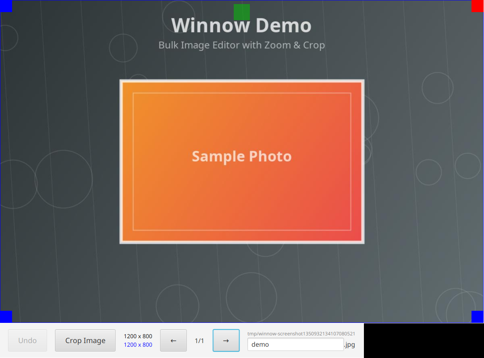

# Winnow - A destructive multiplatform bulk image editor



Edits to crop, rename, and rotate images, applied immediately on disk (there is an undo queue kept in the temp 
directory (/tmp on linux, %TEMP% on windows) which is cleared on shutdown). You will be prompted for an image directory 
on first launch, this will be saved to a config file in your user directory (i.e. ~/.winnow.conf on linux, 
%userprofile%/.winnow.conf on windows) so you will not be prompted again.

## Controls:

| Action                       | Key              | Mouse                             | Touchpad                          |
|------------------------------|------------------|-----------------------------------|-----------------------------------|
| Previous Image               | Left Arrow       | Ctrl + Drag Right                 | Swipe Right                       |
| Next Image                   | Right Arrow      | Ctrl + Drag Left                  | Swipe Left                        |
| Zoom In                      | Dash/Minus       | Wheel Forward                     | Pinch                             |
| Zoom Out                     | Equals/Plus      | Wheel Backwards                   | Expand                            |
| Rotate Right                 | Ctrl + E         | Drag Top Right Clockwise          | Drag Top RightClockwise           |
| Rotate Left                  | Ctrl + Q         | Drag Top Right Counterclockwise   | Drag Top Right Counterclockwise   |
| Expand Right Selection Right | Ctrl + D         | Drag Bottom Right Rectangle Right | Drag Bottom Right Rectangle Right |
| Reduce Right Selection Left  | Ctrl + A         | Drag Bottom Right Rectangle Left  | Drag Bottom Right Rectangle Left  |
| Expand Bottom Selection Down | Ctrl + S         | Drag a Bottom Rectangle Down      | Drag a Bottom Rectangle Down      |
| Reduce Bottom Selection Up   | Ctrl + W         | Drag a Bottom Rectangle Up        | Drag a Bottom Rectangle Up        |
| Expand Left Selection Right  | Shift + Ctrl + D | Drag a Left Rectangle Right       | Drag a Left Rectangle Right       |
| Reduce Left Selection Left   | Shift + Ctrl + A | Drag a Left Rectangle Left        | Drag a Left Rectangle Left        |
| Expand Top Selection Down    | Shift + Ctrl + S | Drag a Top Rectangle Down         | Drag a Top Rectangle Down         |
| Reduce Top Selection Up      | Shift + Ctrl + W | Drag a Top Rectangle Up           | Drag a Top Rectangle Up           |
| Undo                         | Ctrl + Z         | Press Undo Button                 | Press Undo Button                 |

Focus between fields on the control window can be cycled via tab. Focus can be shifted between the control and image
windows via Ctrl+Tab.
The selection rectangle can be moved by dragging the green selection handle.

## Design

- Uses the ImageJ library to do a lot of the heavy lifting of image processing and manipulation
- Uses JavaFX because it has out of the box support for multitouch
- ImageJ uses swing, so this requires converting the buffered image to JavaFX (as embedding a swing component in JavaFX
  can be slow) and maintaining our own ROI.

### Classes

- `UndoManager`: Manages undo queue using byte-for-byte file copying to preserve image quality. Creates temp directories per session with automatic cleanup via shutdown hooks.
- `ConfigManager`: Handles persistent user settings (last directory, last position) in `~/.winnow.conf` using Java Properties format.
- `Window`: Main UI container managing the filename editor, crop/undo buttons, and file operations. Consolidates common image save/rename operations.
- `CustomImageCanvas`: Interactive JavaFX Canvas for image display with selection ROI and rotation. Converts ImageJ BufferedImages to JavaFX format. Maintains original image copy for quality-preserving rotation. Implements intelligent selection rectangle clamping when zoomed past window bounds.
- `InputDispatcher`: Centralizes keyboard shortcuts, mouse/touchscreen gestures, and zoom controls. Uses event filtering to support modifier key combinations.
- `Main`: JavaFX Application that manages the image directory, file navigation, per-image undo managers, and application lifecycle.

### Design Decisions

**Image Quality Preservation**:
- Undo operations use `Files.copy()` for byte-for-byte file copying instead of re-encoding images
- Rotation always transforms from the original unrotated image to avoid cumulative quality loss
- Cumulative rotation tracking prevents canvas size drift during rotation

**Library Integration**:
- ImageJ library provides robust image loading and processing (handles many formats, color spaces)
- JavaFX chosen for native multitouch/gesture support
- BufferedImage → JavaFX Image conversion happens at render time to avoid Swing/JavaFX mixing issues

**Per-Image State Management**:
- Each image gets its own UndoManager instance (tracked by position index)
- File renames tracked through undo operations to support correct restoration
- Config file remembers last directory and position for seamless session resumption

**Input Handling**:
- Keyboard shortcuts support modifier combinations (Ctrl, Shift, Alt)
- Mouse drag threshold (50px) prevents accidental navigation
- Touchscreen rotation via red handle in top-right corner with live preview

**Zoom and Selection Management**:
- Selection rectangle visibility is maintained when zooming beyond window bounds
- Visible canvas bounds calculated dynamically based on scene size and zoom scale
- Selection dimensions in control panel reflect actual visible image area, not full selection
- Canvas coordinates used for drawing while visible bounds clamp what appears on screen

## Building and Packaging

Follow these steps to manually create packages you can install on linux, mac, and windows for testing.

### Prerequisites
- JDK 17 or later (with jpackage support)
- Gradle 8.0+ (included via wrapper)
- For windows builds, as administrator you will first need to install: winget install --id=WiXToolset.WiXToolset

### Release Process

Before creating a release:

1. Update the version in `build.gradle`:
   ```gradle
   version = 'N.N.N'
   ```

2. Update the README screenshot (requires graphical environment):
   ```bash
   ./gradlew updateReadmeScreenshot
   ```
   This generates a fresh screenshot showing the current UI and automatically updates the README.

3. Build and test:
   ```bash
   ./gradlew build
   ```

4. Commit changes:
   ```bash
   git add -A
   git commit -m "Release vN.N.N"
   ```

5. Create and push the release tag:
   ```bash
   git tag vN.N.N
   git push origin main --tags
   ```

GitHub Actions will automatically build platform-specific installers and create the release.

### Manual Installer Creation

You can also create installers manually for specific platforms:

```bash
./gradlew jpackage -PinstallerType=deb   # Linux (Debian/Ubuntu)
./gradlew jpackage -PinstallerType=rpm   # Linux (Fedora/RHEL)
./gradlew.bat jpackage -PinstallerType=msi  # Windows
./gradlew jpackage -PinstallerType=dmg   # macOS
```

### Output Locations
- Runtime image: `build/image/bin/winnow`
- Installers: `build/jpackage/`
- JAR: `build/libs/`

### Troubleshooting Installation Issues

On linux, if the installed application doesn't launch, run it from the terminal:

```bash
dpkg -L winnow | grep bin
# Use the path from that here, for example:
/opt/winnow/bin/Winnow
```